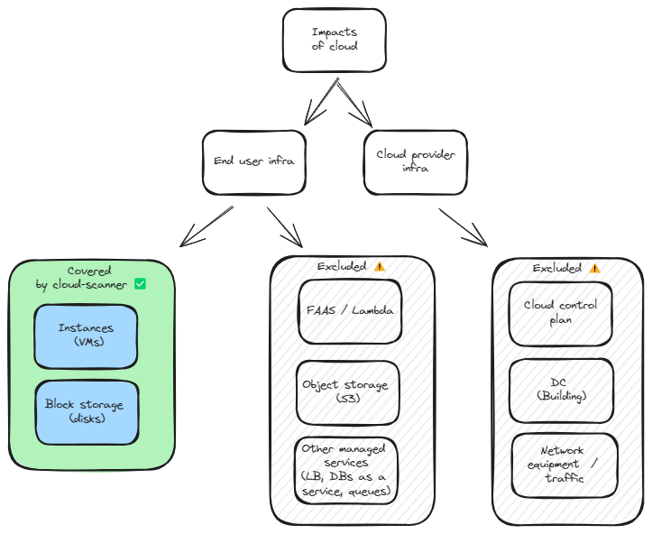

# Limits

## Does not cover all aspects

*Instances* and *block storage* only

- Missing object storage (S3), serverless (lambda) or DB as a service
- Not the entire scope (control plan, network and cloud provider infra not accounted)

=> underestimate !

## Lack fine grain attribution for Kubernetes

Does not offer fine grain attribution in case of container orchestration (i.e. does not go down to the container or micro service level).

- See work of SBS
